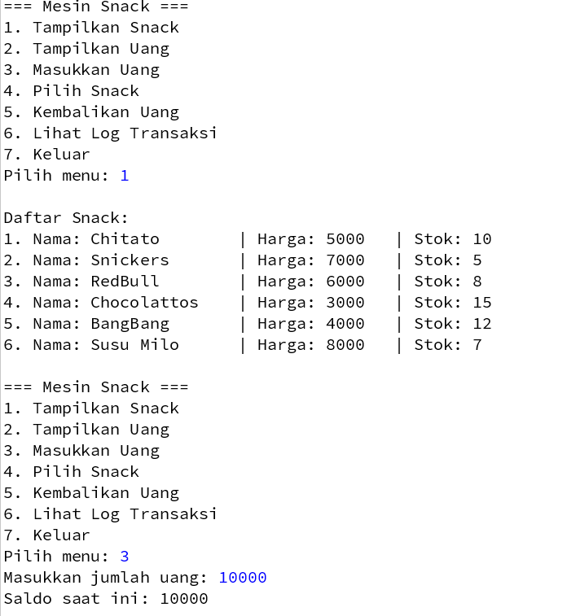

###### Selasa, 14 Oktober 2025
### Evaluasi Tengah Semester
---
<h1><b>Vending Snack Machine</b></h1>

---

## Daftar Isi

0. [Deskripsi Umum](#0-deskripsi-umum)
1. [Source Code](#1-source-code)
2. [Penjelasan Code](#2-penjelasan-code)
3. [Contoh Output + Link Video Demo (Youtube)](#3-contoh-output--link-video-demo-youtube)
4. [Kesimpulan](#4-kesimpulan)

---

## 0. Deskripsi Umum

**Sistem Vending Snack Machine** adalah aplikasi berbasis Java yang mensimulasikan cara kerja mesin penjual otomatis untuk makanan dan minuman ringan.
Pengguna dapat memilih produk yang tersedia, memasukkan uang untuk pembayaran, dan menerima produk jika saldo mencukupi.

Aplikasi ini juga mencatat setiap transaksi ke dalam log, menampilkan stok produk yang tersedia, dan memberikan peringatan ketika stok habis agar admin dapat melakukan pengisian ulang.

### Fitur Utama:

* Menampilkan daftar snack beserta harga dan stok.
* Memasukkan uang (saldo) ke mesin.
* Memilih produk untuk dibeli.
* Menangani kondisi stok habis atau saldo tidak cukup.
* Menampilkan log transaksi.
* Mengembalikan uang (jika ada sisa saldo).

### Alur Sistem (Flow)

1. Mesin aktif → menampilkan menu pilihan produk.
2. Pengguna memilih jenis produk.
3. Mesin menampilkan total harga.
4. Pengguna melakukan pembayaran.
5. Mesin memverifikasi pembayaran:

   * Jika saldo cukup → produk dikeluarkan.
   * Jika saldo kurang → transaksi dibatalkan.
6. Transaksi disimpan ke log.
7. Jika stok habis → admin diingatkan untuk melakukan refill.

---

## 1. Source Code

```java
import java.util.ArrayList;
import java.util.Scanner;

class Snack{
    private String name;
    private int price;
    private int stock;

    public Snack(String name, int price, int stock) {
        this.name = name;
        this.price = price;
        this.stock = stock;
    }

    public String getName() {
        return name;
    }

    public int getPrice() {
        return price;
    }

    public int getStock() {
        return stock;
    }

    public void setStock(int stock) {
        this.stock = stock;
    }

    @Override
    public String toString() {
        return "Nama: " + name + "\t| Harga: " + price + "\t| Stok: " + stock;
    }
}

class VendingMachine {
    private ArrayList<Snack> snacks;
    private int balance;
    private ArrayList<String> log;
    private Scanner sc = new Scanner(System.in);
    private int total;

    public VendingMachine() {
        snacks = new ArrayList<>();
        balance = 0;
        log = new ArrayList<>();
    }

    public int getBalance() {
        return balance;
    }

    public void addSnack(Snack snack) {
        snacks.add(snack);
    }

    public void displaySnacks() {
        System.out.println("\nDaftar Snack:");
        for (int i = 0; i < snacks.size(); i++) {
            System.out.println((i + 1) + ". " + snacks.get(i));
        }
    }

    public void insertMoney(int amount) {
        if (amount > 0) {
            balance += amount;
            System.out.println("Saldo saat ini: " + balance);
        } else {
            System.out.println("Jumlah uang tidak valid.");
        }
    }

    public void selectSnack(int index) {
        if (index < 1 || index > snacks.size()) {
            System.out.println("Pilihan tidak valid.");
            return;
        }

        Snack selectedSnack = snacks.get(index - 1);
        if (selectedSnack.getStock() <= 0) {
            System.out.println("Maaf, snack ini habis. Admin akan mengisinya.");
            return;
        }

        System.out.print("Masukkan total snack: ");
        total = sc.nextInt();
        if (total > selectedSnack.getStock()) {
            System.out.println("Stok tidak cukup. Stok tersedia: " + selectedSnack.getStock());
            return;
        }
        if (balance < selectedSnack.getPrice() * total) {
            System.out.println("Saldo Anda tidak cukup.");
            return;
        }
        balance -= selectedSnack.getPrice() * total;
        selectedSnack.setStock(selectedSnack.getStock() - total);
        System.out.println("Anda membeli: " + total + " " + selectedSnack.getName());
        System.out.println("Sisa saldo: " + balance);
        log.add("Membeli " + total + " " + selectedSnack.getName() + " seharga " + selectedSnack.getPrice() + " (total: " + (selectedSnack.getPrice() * total) + ")");
    }

    public void returnChange() {
        if (balance > 0) {
            System.out.println("Kembalian Anda: " + balance);
            balance = 0;
        } else {
            System.out.println("Tidak ada saldo untuk dikembalikan.");
        }
    }

    public void displayLog() {
        if(log.isEmpty()){
            System.out.println("Belum ada transaksi.");
            return;
        }
        System.out.println("\nLog Transaksi:");
        for (String entry : log) {
            System.out.println(entry);
        }
    }
}

public class VendingSnackMachine {
    public static void main(String[] args){
        VendingMachine vm = new VendingMachine();
        Scanner sc = new Scanner(System.in);

        vm.addSnack(new Snack("Chitato", 5000, 10));
        vm.addSnack(new Snack("Snickers", 7000, 5));
        vm.addSnack(new Snack("RedBull", 6000, 8));
        vm.addSnack(new Snack("Chocolattos", 3000, 15));
        vm.addSnack(new Snack("BangBang", 4000, 12));
        vm.addSnack(new Snack("Susu Milo", 8000, 7));

        int choice;
        do {
            System.out.println("\n=== Mesin Snack ===");
            System.out.println("1. Tampilkan Snack");
            System.out.println("2. Tampilkan Uang");
            System.out.println("3. Masukkan Uang");
            System.out.println("4. Pilih Snack");
            System.out.println("5. Kembalikan Uang");
            System.out.println("6. Lihat Log Transaksi");
            System.out.println("7. Keluar");
            System.out.print("Pilih menu: ");
            choice = sc.nextInt();

            switch (choice) {
                case 1:
                    vm.displaySnacks();
                    break;
                case 2:
                    System.out.println("Saldo saat ini: " + vm.getBalance());
                    break;
                case 3:
                    System.out.print("Masukkan jumlah uang: ");
                    int amount = sc.nextInt();
                    vm.insertMoney(amount);
                    break;
                case 4:
                    vm.displaySnacks();
                    System.out.print("Pilih nomor snack: ");
                    int snackIndex = sc.nextInt();
                    vm.selectSnack(snackIndex);
                    break;
                case 5:
                    vm.returnChange();
                    break;
                case 6:
                    vm.displayLog();
                    break;
                case 7:
                    System.out.println("Terima kasih telah menggunakan mesin snack!");
                    break;
                default:
                    System.out.println("Pilihan tidak valid.");
            }
        } while (choice != 7);
        sc.close();
    }
}

```

---

## 2. Penjelasan Code

|Gambar 1. Hubungan antar-Class|
|-|
||


### 2.1 Kelas `Snack`

Kelas ini merepresentasikan objek **snack** yang dijual oleh mesin.
Berisi atribut dan method dasar seperti:

* **Atribut:**

  * `name` → nama snack
  * `price` → harga snack
  * `stock` → jumlah stok snack
* **Method:**

  * `getName()`, `getPrice()`, `getStock()` → getter untuk mengambil nilai atribut.
  * `setStock(int stock)` → setter untuk memperbarui stok.
  * `toString()` → menampilkan informasi snack dalam format teks.

Class ini bertujuan untuk membuat representasi data dari produk yang dijual.

---

### 2.2 Kelas `VendingMachine`

Kelas ini berfungsi sebagai logika utama mesin penjual otomatis.
Menangani daftar snack, saldo pengguna, serta proses transaksi.

#### Atribut:

* `snacks` → list dari objek `Snack`.
* `balance` → saldo uang yang dimasukkan pengguna.
* `log` → daftar riwayat transaksi.
* `Scanner sc` → untuk input dari pengguna.
* `total` → jumlah item yang dibeli.

#### Konstruktor:

* `VendingMachine()` → menginisialisasi semua atribut (saldo 0, daftar snack kosong, dan log kosong).

#### Method Utama:

1. **`addSnack(Snack snack)`**
   Menambahkan snack baru ke daftar mesin.

2. **`displaySnacks()`**
   Menampilkan semua snack dengan nomor urut, nama, harga, dan stok.

3. **`insertMoney(int amount)`**
   Menambahkan saldo jika jumlah uang valid (>0).

4. **`selectSnack(int index)`**
   Menangani proses pembelian:

   * Mengecek validitas pilihan.
   * Mengecek stok snack.
   * Meminta jumlah pembelian (`total`).
   * Mengecek saldo pengguna.
   * Mengurangi stok dan saldo jika pembelian berhasil.
   * Mencatat transaksi ke `log`.

5. **`returnChange()`**
   Mengembalikan uang sisa ke pengguna jika saldo > 0.

6. **`displayLog()`**
   Menampilkan seluruh riwayat transaksi.

Class ini memiliki tujuan untuk menyediakan seluruh fitur utama mesin penjual otomatis.

---

### 2.3 Kelas `VendingSnackMachine` (Main Class)

Kelas utama yang berisi **fungsi `main()`**, berperan sebagai antarmuka pengguna (console-based).

#### Proses Utama:

1. Membuat instance `VendingMachine`.
2. Menambahkan beberapa snack ke dalam mesin (seperti *Chitato*, *Snickers*, *Susu Milo*, dll).
3. Menampilkan menu interaktif:

   * 1 → Tampilkan daftar snack
   * 2 → Tampilkan saldo
   * 3 → Masukkan uang
   * 4 → Pilih snack untuk dibeli
   * 5 → Kembalikan uang
   * 6 → Lihat log transaksi
   * 7 → Keluar

Setiap opsi diproses dengan **`switch-case`** untuk mengeksekusi method yang sesuai pada objek `VendingMachine`.

Class ini bertujuan untuk menyediakan tampilan interaktif agar pengguna dapat menggunakan mesin melalui terminal.

---

## 3. Contoh Output + Link Video Demo (Youtube)

|Gambar 2. Contoh Output 1|
|-|
||

|Gambar 3. Contoh Output 2 (gambar terpotong)|
|-|
||

|Gambar 4. Contoh Output 3|
|-|
||

|Gambar 5. Contoh Output 4|
|-|
||

|Gambar 6. Contoh Output 5|
|-|
||

|Gambar 7. Contoh Output 6|
|-|
||

|Gambar 8. Contoh Output 7|
|-|
||

|Gambar 9. Contoh Output 8|
|-|
||

|Gambar 10. Contoh Output 9|
|-|
||

Link Video Demo: https://youtu.be/OSqE0wYfJIE

---

## 4. Kesimpulan

Program Vending Snack Machine merupakan simulasi sederhana mesin penjual otomatis berbasis Java dengan konsep Object-Oriented Programming (OOP).
Program ini menampilkan bagaimana kelas, objek, enkapsulasi, dan interaksi antar objek digunakan untuk membuat sistem yang modular dan mudah dikembangkan.

---
###### Ditulis oleh **Muhammad Quthbi Danish Abqori - 5025241036**